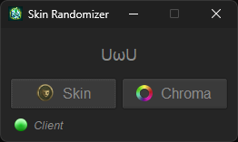

# LoL Skin Randomizer

Simple application that allows you to randomly select a champion skin and skin chroma when playing League of Legends. If you own a lot of skins and always wonder which one to use then this tool is for you.

    

### Download

You can either download a release, or build the binary yourself

- Get the latest release from [here](https://github.com/Guido30/LoLSkinRandomizer/releases)  
  OR
- Download and install [cargo](https://www.rust-lang.org/tools/install), then run `cargo build --release`, you can find the built binary inside the target/release folder
